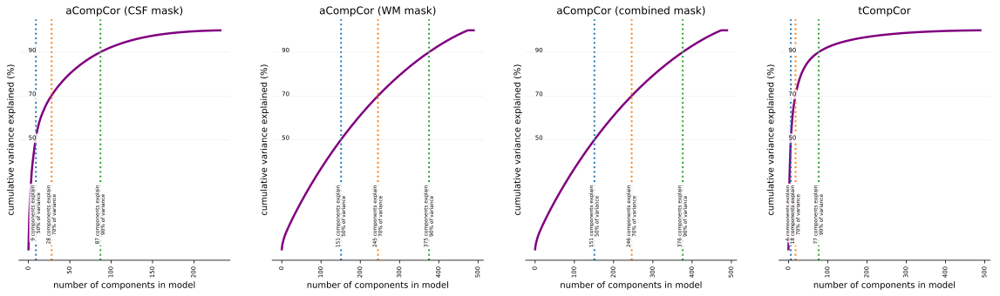

# fmriprep_qa_guide
Rough draft of a guide for reviewing fmriprep's QA outputs

# Anatomicals
## Brain mask and brain tissue segmentation of the T1w
* _Brain mask:_ make sure the red line is going around the brain and does not stray into the dura or cut off pieces of the brain.
* _Segmentation:_ make sure the blue line follows the boundary between the white matter and the grey matter and isn't cutting off pieces of the white matter

## Spatial normalization of the anatomical T1w reference
* Look at the images as they transition back and forth and check the following:
  - Are the ventricles in the same place?
  - Is the grey matter/ white matter boundary stable?
  - Does any of the brain in the participant view look especially stretched or distorted?
 
## Surface reconstruction
* Similar to what you check for the mask and segmentation
* The red line should outline the outer boundary of the grey matter and exclude the cerebellum
* the blue line should follow the boundary between the grey matter and the white matter
* Here's a good example:

# Functionals
## Susceptibility distortion correction
* The brains displayed here are functional volumes before and after distortion correction. The blue line is the grey matter/ white matter boundary derived from the anatomical scans.
* The brain after the distortion correction should be better aligned with boundary derived from the functional.
* The after image should also appear less distorted and shaped more like a normal brain, this may be subtle when the distortion correction is working, but can really, really stand out when it fails.

## Alignment of functional and anatomical MRI data (surface driven)
* Mouse over to transition back and forth between "fixed" and "moving". Fixed displays the red and blue lines of the Freesurfer surfaces on the anatomical image. Moving displays the functional that has been aligned to the structural while retaining the red and blue lines of the grey matter and white matter surface from the anatomical.
* Depending on your bold sequence, you may not be able to make out much, but you should still be able to see the grey matter / white matter boundary. Make sure that this boundary follows the blue line and internal structures well aligned. 
* You may have artefacts that cause loss of signal in the more inferior parts of the brain in the functional data. Disregard this drop out and make sure that the parts of the image the do have signal are well aligned.

## Brain mask and (temporal/anatomical) CompCor ROIs
* These images shows the masks used for anatomical component correction. 
* Make sure that the brain mask shown by the red contour is outside the brain in the functional image.
* Make sure the magenta lines are well inside the white matter/CSF. 
* In general, areas outlined by the blue lines should be areas with high CSF or blood flow, such as between the hemispheres, in ventricles, and between the cortex and the cerebellum. These are the most variable voxels, that will be used later on for functional component correction. 

## Variance explained by t/aCompCor components
* The voxels remains within the afromentioned brain mask are used to generate compcor curves for the white matter, csf, combined white matter and csf, and temporal variation. 
* The graphs in this section shows the amount of variance explained by different amounts of components. For example the first ~150 components in the white matter mask below explains the top 50 percent of the variance occurs within nuisance white matter voxels estimated by the mask ROI.
 

* fMRIprep uses these estimations to decide which components to save. As default fMRIprep saves those components that contributes in explaining that half of the variance in the ROI. However it can be changed from the settings. 

* Based on the amount of variance that you want to account in your data, you will decide removing the nuisance variants.
* One thing to take into account that, adding more nuisance regressors comes with removal of more degrees of freedom and less statistical power. 

## BOLD Summary
* Contains time series plots for global signal (GS), global signal of CSF (GSCSF), global signal of white matter (GSWM), and two measures of motion DVARS and framewise displacement (FD).
* Look for any big spikes in any of the line plots.
* Review the carpet plot (the thing that looks like static that). This plot shows you the time series of each major tissue types. The blue column represents the voxels from cortical areas, orange column represents subcortical, green is for gray matter and cerebellum, and red for white matter and CSF. For any columns that all seem to have a jump in values, this will look like vertical bands or lines down the plot covers across the entire column for that time point. 

## Correlations among nuisance regressors
* The heat-map plot shows the correlations between different confound nuisance regressors. 
* High correlations can maybe explained by a motion that caused a signal change in one tissue type that affects the other.
* Similarly, the bar chart shows the extent of correlation between the different tissue specific regressors and the global signal. 
* The components shows high correlation could be considered as the nuisance regressors and used in the model.

## ICA Components classified by AROMA
* The brain distribution of ICA components classified as noise should look like this:

* And the Temporal components should look like this for signal and noise respectively:

Image from [FSL ICA practical](https://fsl.fmrib.ox.ac.uk/fslcourse/lectures/practicals/ica/index.html)
